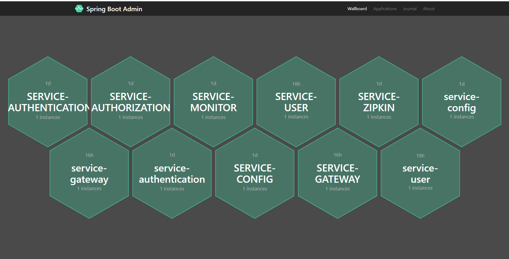
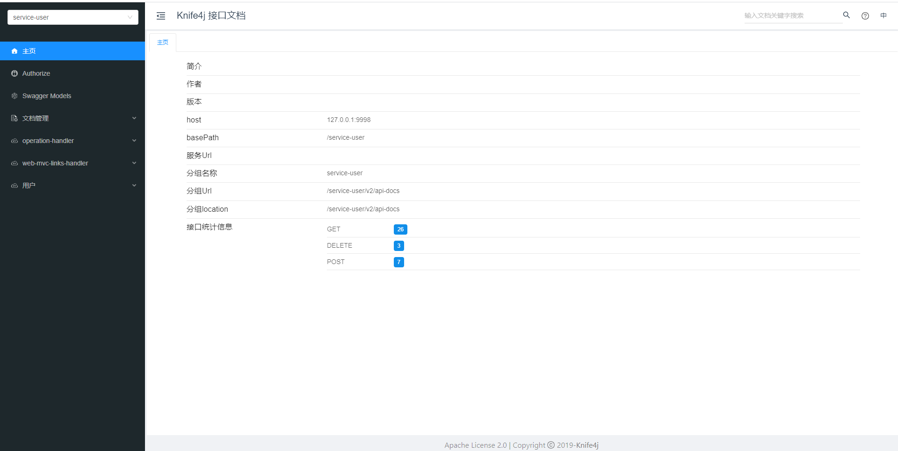
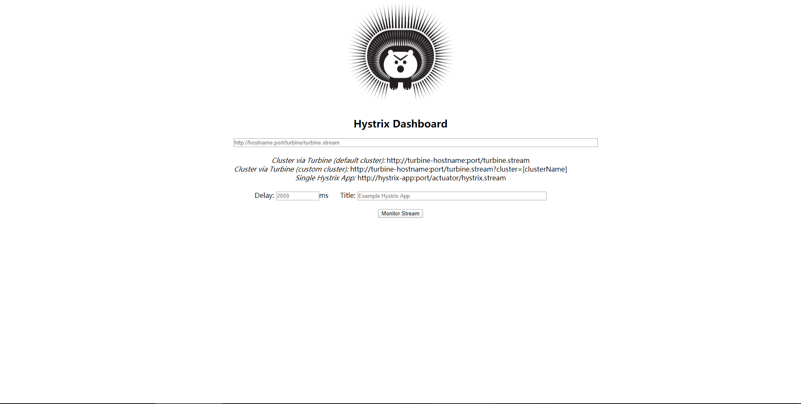

# Spring Cloud Template 分布式微服务系统
 <p align="center">
  <a href="https://github.com/TyCoding/cloud-template/" target="_blank">
    
  </a>
  
  
 </p>
## 写在前面

在开始此项目前，请先学习这个基础项目模板 [spring-cloud-template](https://github.com/KittyMi/spring-cloud-template) ，并仔细阅读以下开发文档：

[从零开始搭建Spring Cloud脚手架](https://github.com/KittyMi/spring-cloud-template/README.md)

## Spring Cloud Template

* 一套极简的Spring Cloud微服务项目模板，开箱即用，方便扩展

* 基于 Spring Cloud Greenwich、Spring Boot 、Mybatis Plus的微服务项目

* 详细的开发文档

## 核心依赖

| 依赖 | 版本 |
| --- | --- |
| Spring Boot | 2.1.5.RELEASE |
| Spring Cloud | Greenwich.SR1 |
| Spring Security OAuth2 | 2.3.4.RELEASE |
| Mybatis Plus | 3.1.1 | 
| Swagger2 | 2.9.2 |

## 启动说明

1. 修改本地`hosts`文件，添加如下内容。

```
127.0.0.1 eureka1 eureka1 zipkin mysql auth
```

2. 修改`config-repository/`下配置文件中的数据库连接信息，主要涉及`service-core.yml`和`service-mybatis.yml`、`service-redis.yml`、`service-redisson.yml`这些文件

3. 导入项目根目录下的`init.sql`，建立数据库

默认密码请参看`service-user/src/test/PasswordEncoderTest.java`测试类

| Username | Password |
| --- | --- |
| andy | andy |
| admin | admin |
| test | test |

4. 严格按照如下顺序依次启动服务模块

```
1. EurekaApplication.java -- 服务注册中心 [9001 9002]
2. ConfigApplication.java -- 服务配置中心 [9003]
3. MonitorApplication.java -- Spring Boot Admin监控 [9004]
4. hystrixApplication.java -- Hystrix断路器监控 [9005]
4. ZipkinApplication.java -- Zipkin链路监控 [9006]
5. UserApplication.java -- 用户模块 [9009]
6. AuthenticationApplication.java --鉴权服务模块 [9010]
7. AuthorizationApplication.java -- 授权服务模块 [9011]
网关(1.zuul 2.gateway(spring cloud的亲儿子))
8.1 ZuulApplication.java -- Zuul网关 [9999]
8.2 GatewayApplication.java -- Gateway网关 [9998] 支持webscoket协议等
```

## 功能预览









