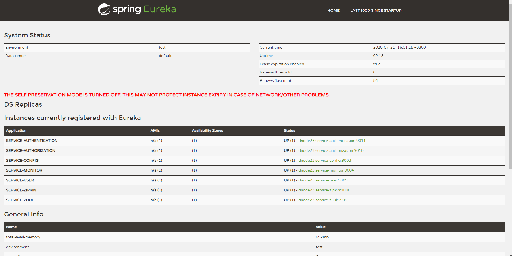
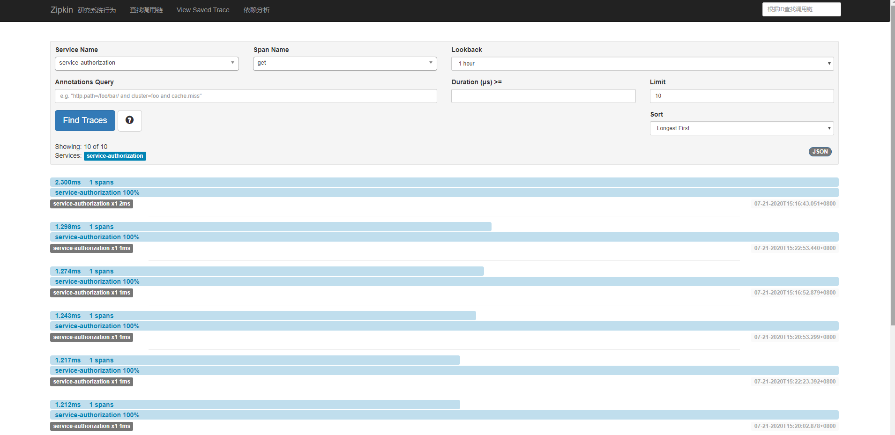

# Spring Cloud Template 分布式微服务系统 -- 后端

## 写在前面

在开始此项目前，请先学习这个基础项目模板 [cloud-template](https://github.com/TyCoding/cloud-template/tree/master/cloud-template) ，并仔细阅读以下开发文档：

[从零开始搭建Spring Cloud脚手架](https://github.com/TyCoding/cloud-template/blob/master/cloud-template/doc/env-1.md)

## 启动说明

1. 修改本地`hosts`文件，添加如下内容。

```
127.0.0.1 eureka1 eureka1 zipkin mysql auth
```

2. 修改`config-repository/`下配置文件中的数据库连接信息，主要涉及`service-core.yml`和`service-mybatis.yml`、`service-redis.yml`、`service-redisson.yml`这些文件

3. 导入项目根目录下的`init.sql`，建立数据库

默认密码请参看`service-user/src/test/PasswordEncoderTest.java`测试类

| Username | Password |
| --- | --- |
| andy | andy |
| admin | admin |
| test | test |

4. 严格按照如下顺序依次启动服务模块

```
1. EurekaApplication.java -- 服务注册中心 9001 9002
2. ConfigApplication.java -- 服务配置中心 9003
3. MonitorApplication.java -- Spring Boot Admin监控 9004
4. ZipkinApplication.java -- Zipkin链路监控 9006
5. UserApplication.java -- 用户模块 9009
6. AuthenticationApplication.java --鉴权服务模块 9010
7. AuthorizationApplication.java -- 授权服务模块 9011
网关(1.zuul 2.gateway(spring cloud的亲儿子))
8.1 ZuulApplication.java -- Zuul网关 9999
8.2 GatewayApplication.java -- Gateway网关 9998 支持webscoket协议等
```

5. 启动前端项目

```shell
$ cd app-front
$ npm install
$ npm run dev
```

既然都使用了Spring Cloud微服务，必然要配合Vue前端框架使用才更舒服。在 [Spring Cloud Template分布式微服务前端](https://www.6868blog.com/cloud-template-app/) 文档中已经详细介绍了在Spring Cloud项目中如何配合`vue-admin-template`前端模板项目实现基础的CRUD业务，如果你与一定的Vue基础，相信 [cloud-template](https://github.com/TyCoding/cloud-template) 项目的简洁性足够让你快速了解Vue前后端分离式开发流程了。

## Vue组件嵌套页面

Spring Cloud配合Vue单页面应用食用，可能会遇到一些问题，就是如何在Vue组件找那个嵌套Spring Cloud系列框架内置的UI页面，比如Spring Boot Admin监控中心、Eureka注册中心、Zipkin链路监控、Swagger2文档等等，这些框架内部提供了UI界面，但如何把它嵌套进我们的Vue单页面项目中呢？

注意：这部分我们仅是介绍如何实现在Vue组件中嵌套第三方的UI页面，这可能在一些权限管理项目、应用监控项目中常见，毕竟他们已经写好的非常漂亮的界面，我们又有什么理由不用呢？


## 功能预览





